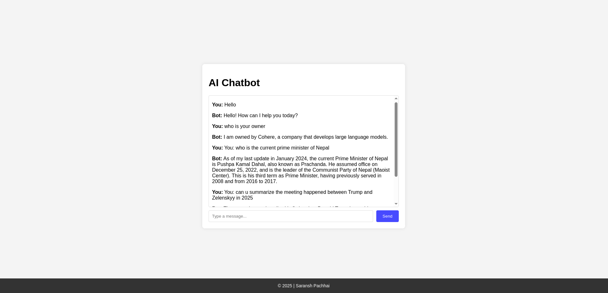

# AI-Chatbot 🤖



An AI-powered chatbot built with **Node.js** (backend), **React.js** (frontend), and **Cohere AI** for natural language processing. Chat with an intelligent bot in real-time!

---

## Features

- **Real-time Chat**: Interact with the chatbot instantly.
- **Dynamic Responses**: Powered by Cohere AI for smart replies.
- **User-Friendly UI**: Built with React.js for a smooth experience.
- **Persistent Chat History**: Stores conversations in MongoDB.
- **Environment-Specific Configuration**: Easily switch between development and production modes.

---

## Technologies

- **Frontend**: React.js, Vite, Axios
- **Backend**: Node.js, Express.js, Cohere AI, MongoDB

---

## Installation

1. **Clone the Repository**

   ```bash
   git clone https://github.com/saransh619/AI-Chatbot.git
   cd AI-Chatbot
   ```

2. **Install Dependencies**
   For the frontend:

   ```bash
   cd client
   npm install
   ```

   For the backend:

   ```bash
   cd server
   npm install
   ```

3. **Set Environment Variables**

   ```bash
   cd server
   cp .env.example .env

   COHERE_API_KEY: Sign up on Cohere AI to get your API key.
   MONGO_URI: Create a free cluster on MongoDB Atlas and get your connection string.
   NODE_ENV: Set to development for local development or production for deployment.
   ```

4. **Start the Server (Backend)**
   In the server folder, run:

   ```bash
   npm run dev
   ```

5. **Start the Client (Frontend)**
   In the client folder, run:

   ```bash
   npm run dev
   ```

---

## Usage

1. Open the app in your browser.
2. Type a message and press Enter or click Send.
3. Enjoy chatting with the AI!

---

## Environment Configuration

Development Mode (NODE_ENV=development)

- **Frontend URL**: http://localhost:5173
- **Backend URL**: http://localhost:5000
- **CORS**: Allows requests from http://localhost:5173.
- Use this mode for local development and testing.

Production Mode (NODE_ENV=production)

- **Frontend URL**: https://ai-chatbot-talk.netlify.app
- **Backend URL**: https://ai-chatbot-8snz.onrender.com
- **CORS**: Allows requests from https://ai-chatbot-talk.netlify.app
- Use this mode when deploying the application.

---

## Deployment

### Frontend (Netlify)

The frontend is hosted on **Netlify**. You can access the live application here:  
👉 [https://ai-chatbot-talk.netlify.app](https://ai-chatbot-talk.netlify.app)

### Backend (Render)

The backend is hosted on **Render**. The API is accessible at:  
👉 [https://ai-chatbot-8snz.onrender.com](https://ai-chatbot-8snz.onrender.com)

---

## Contributing

Contributions are welcome! If you find any issues or have suggestions for improvements, please open an issue or submit a pull request.

---
